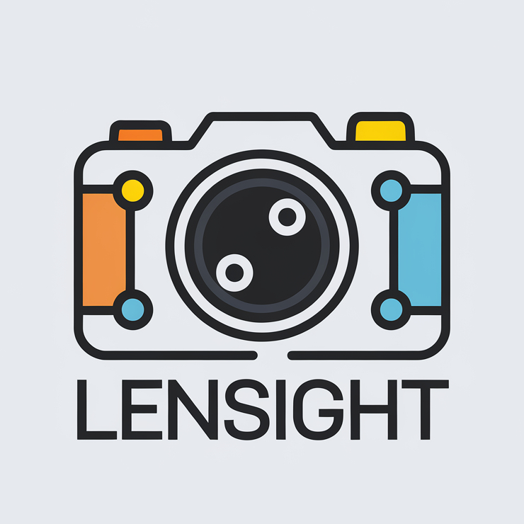
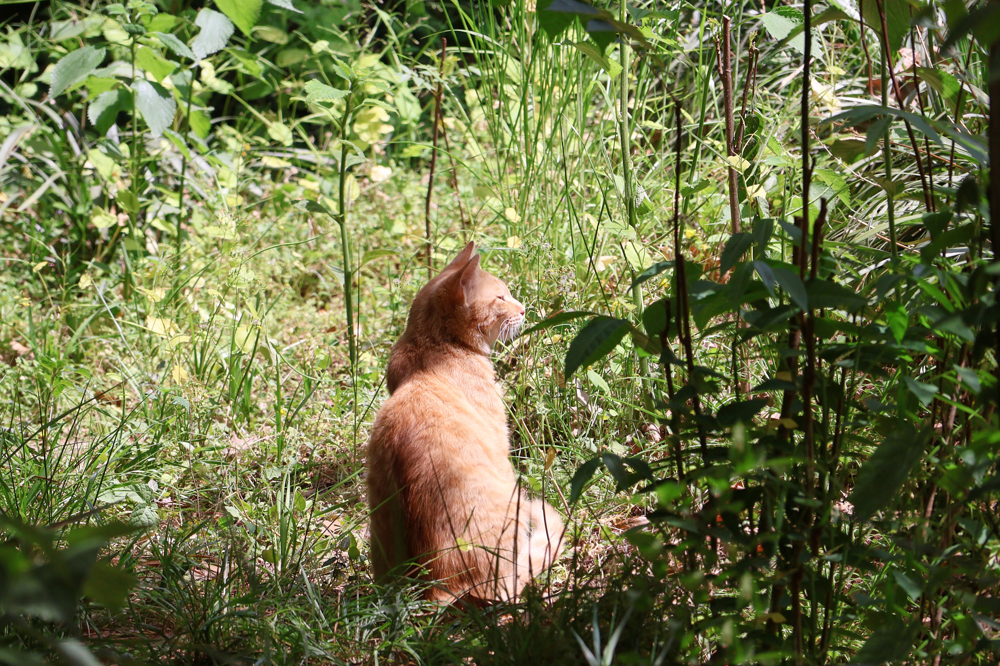
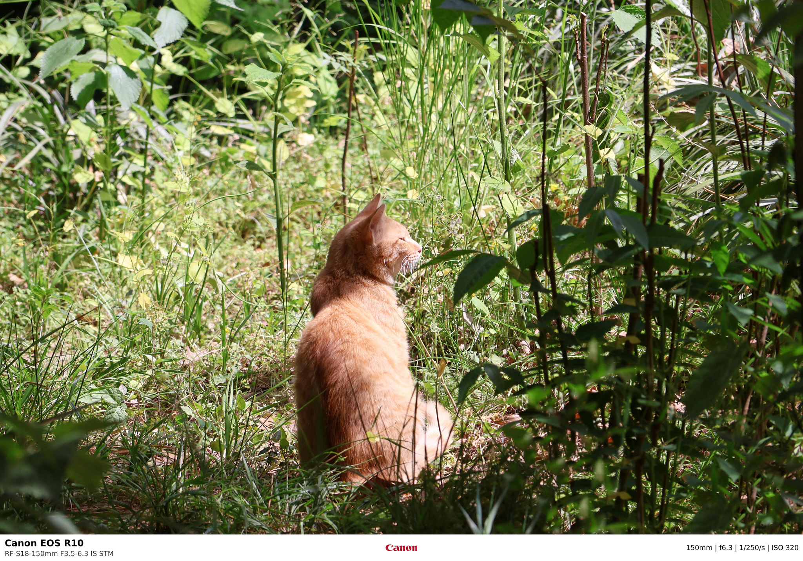
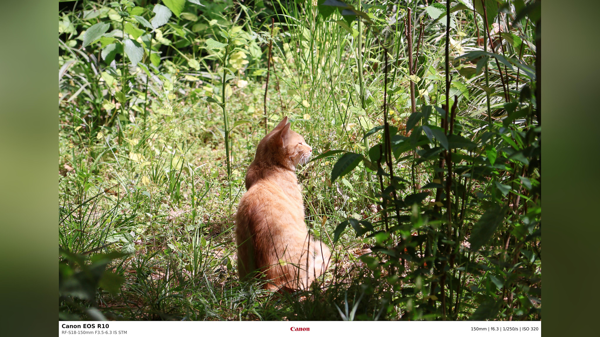

<div align="center">
  
  <br>
  <a href="https://github.com/AngelMsger/lensight/actions/workflows/ci.yml">
    
  </a>
</div>

# Lensight

A command-line tool for embedding camera metadata and shooting details into photos.

## Features

- Embed camera metadata and shooting details into photos
- Support for both single image and batch processing
- Native support for major camera manufacturers (Canon, Nikon, Sony, Fujifilm, Panasonic)
- Optional 16:9 aspect ratio output for video platforms
- Custom logo support
- Configurable information bar height with adaptive font and logo sizing

## Installation

### From Source

1. Ensure you have Rust and Cargo installed
2. Clone the repository:
   ```bash
   git clone git@github.com:AngelMsger/lensight.git
   cd lensight
   ```
3. Build and install:
   ```bash
   cargo install --path .
   ```

### From crates.io

```bash
cargo install lensight
```

## Usage

### Basic Commands

#### Single Image Processing

```bash
lensight input.jpg output.jpg
```

#### Batch Processing

```bash
lensight ./input_directory ./output_directory
```

### Advanced Options

#### Force 16:9 Aspect Ratio

```bash
lensight --force-16-9 input.jpg output.jpg
```

#### Custom Information Bar Height

```bash
lensight ./input ./output --info-height 240
```

#### Custom Logo

When installed via Cargo, Lensight includes built-in logos for Canon, Nikon, Sony, Fujifilm, and Panasonic. When building from source, you can add custom logos by placing them in the `logos` directory with the brand name in lowercase.

To specify a custom logo file:

```bash
lensight ./input ./output --logo logos/custom.png
```

## Examples

Original image:


Processed result:


16:9 aspect ratio result:


> Note: The sample images in the repository have been compressed and their EXIF data removed for preview purposes. Please use your own images for testing.

## Related Projects

- [**camera-watermark**](https://github.com/dearDreamWeb/camera-watermark): Lensight utilizes the logo files organized by this project.

## License

This project is licensed under the MIT License. See the [LICENSE](LICENSE) file for details.
